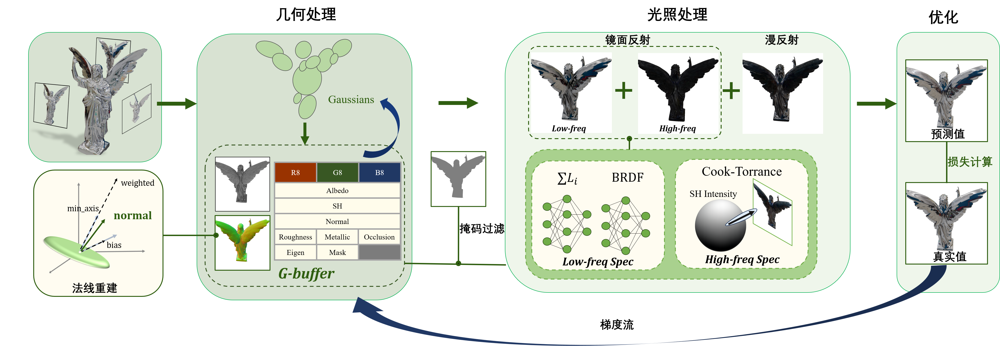

# EnvSample-Free 3D Gaussian Splatting

Official implementation of **"EnvSample-Free 3D Gaussian Splatting"**.

## Overview

EnvSample-Free 3DGS is a novel rendering framework based on **3D Gaussian Splatting (3DGS)** for efficient scene reconstruction and photorealistic novel-view synthesis.

------

## Method

In recent years, 3D Gaussian splatting has leveraged physical reflection models to enhance specular reflection. However, these methods typically require differentiable environment light sampling during training, making it challenging to balance rendering quality and computational efficiency. 

 We propose a neural Gaussian splatting physical rendering method without environment light sampling, which employs a lightweight dual-network architecture to implicitly model low-frequency specular reflections and combines spherical harmonics with the Cook-Torrance model to supplement high-frequency information. This design simultaneously resolves the limitations of single-order spherical harmonics in capturing both low-frequency and high-frequency signals without introducing artifacts, achieving unified modeling of different frequency reflection components and efficient rendering. Furthermore, to overcome the challenge of estimating surface normals for 3D Gaussian primitives, we introduce an eigenvalue-guided normal contraction strategy to guide reliable surface normal reconstruction.



------

## Installation

### Tested Environment

- Ubuntu 22.04
- CUDA 11.8
- NVIDIA RTX 4080 / RTX 4090
- Python 3.10

### Clone Repository

```bash
git clone https://github.com/OwODarkness/EnvSample_Free_3DGS.git
cd EnvSample_Free_3DGS
```

### Create Environment

```bash
conda create -n envsample_free_3dgs python=3.10
conda activate envsample_free_3dgs
```

### Install Dependencies

```bash
pip install -r requirements.txt
```

------

## Dataset

The dataset should be organized as follows:

```text
dataset/
├── luyu_blender/
│   ├── train/
│   ├── test/
│   ├── transforms_train.json
│   └── transforms_test.json
├── horse_blender/
```

------

## Training

Train a scene using:

```bash
python train.py \
    -s dataset/luyu_blender \
    -m output/luyu_blender \
    --eval \
    -w
```

### Arguments

| Argument    | Description                      |
| ----------- | -------------------------------- |
| `-s`        | Dataset path                     |
| `-m`        | Output directory                 |
| `--eval`    | Enable evaluation                |
| `-w`        | Save checkpoints and logs        |
| --roughness | Roughness default value of scene |
| --metallic  | Metallic default value of scene  |

------

## Rendering

Render trained results using:

```bash
python render.py -m output/luyu_blender
```

Rendered images will be saved to:

```text
output/
└── luyu_blender/
    └── renders/
```

------

## Results

### Qualitative Results


### Quantitative Results

| Method | PSNR ↑ | SSIM ↑ | LPIPS ↓ |
| ------ | ------ | ------ | ------- |
| 3DGS   | -      | -      | -       |
| Ours   | -      | -      | -       |

------

## Citation

If you find our work useful, please cite:

```bibtex

```

------

## Acknowledgements

This work is built upon the following excellent projects:

- NeRF
- 3D Gaussian Splatting
- GaussianShader

We thank the authors for making their code publicly available.

## 
