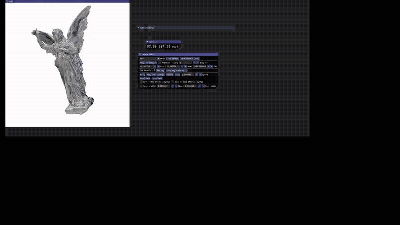
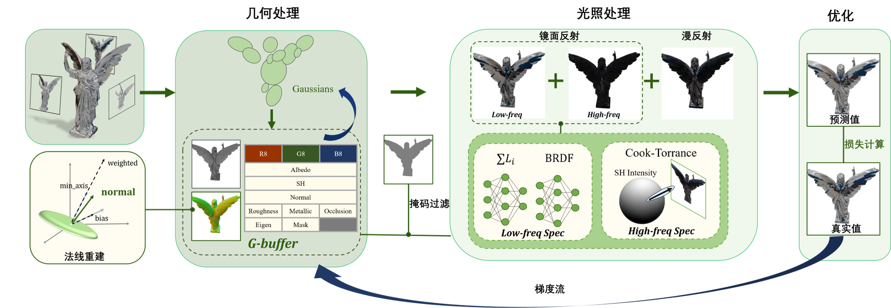
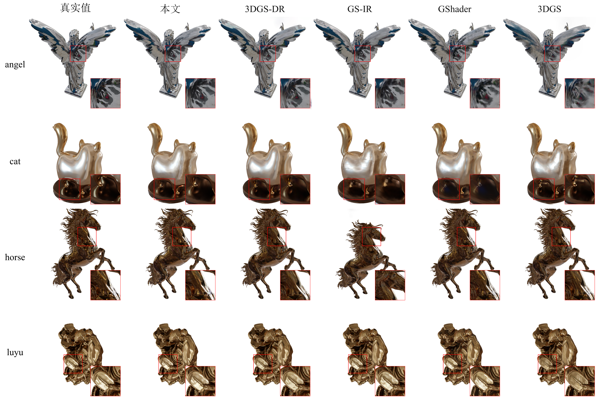
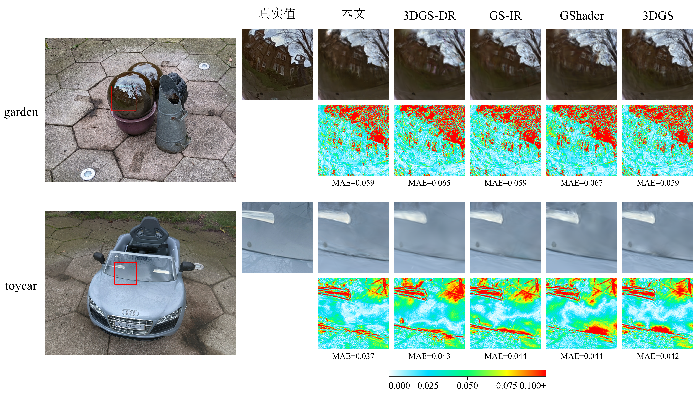
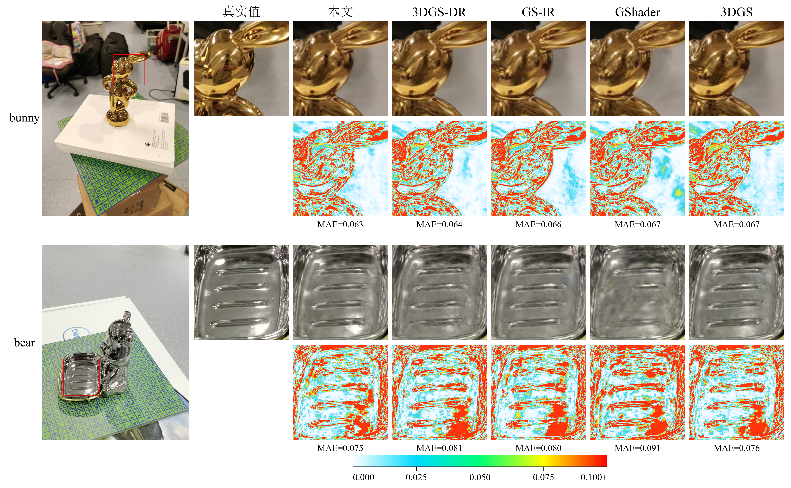
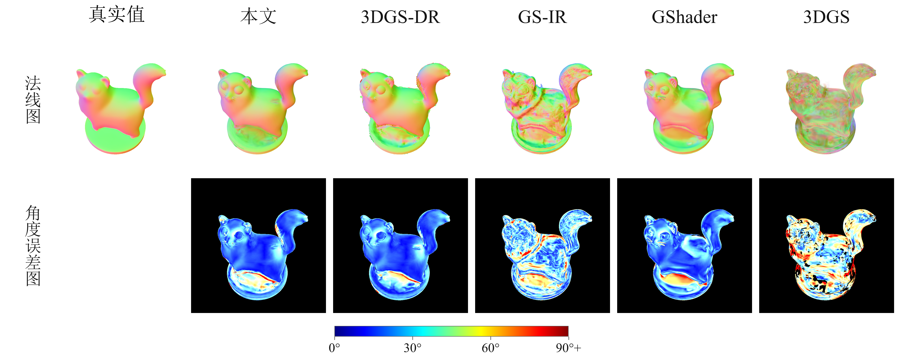

# 面向无环境光采样的神经高斯泼溅物理渲染方法

**面向无环境光采样的神经高斯物理泼溅方法**官方实现

Official implementation of **"Neural Gaussian Splatting for Physically Based Rendering without Environment Light Sampling"**.（For the English README, please click [here](README_EN.md).）

[](https://github.com/OwODarkness/EnvSample_Free_3DGS/blob/main/docs/video/show.mp4)

## Overview

**面向无环境光采样的神经高斯物理泼溅方法**提出了一种基于 **3D Gaussian Splatting（3DGS）** 的新型渲染框架，旨在提高3DGS对于镜面反射的表达，能够高效地完成场景重建，并实现具有真实感的新视角渲染。

------

## Method

近年来，三维高斯泼溅开始通过物理反射模型增强镜面反射成分，以提升新视角合成质量。然而，这类方法通常需要在训练阶段对可微环境贴图进行显式多方向采样与积分，增加计算开销。

为此，提出一种面向无环境光显式采样的神经高斯泼溅物理渲染方法，通过轻量化双网络结构对低频镜面反射进行隐式建模，并结合球谐函数与 Cook–Torrance 模型补充高频信息，从而避免训练阶段对可微环境贴图进行显式采样与积分。此外，提出基于特征值引导的法线收缩策略，以提升表面法线重建的稳定性。



------

## 安装

### 软硬件环境要求

- Ubuntu 22.04
- CUDA 11.8
- NVIDIA RTX 4080 / RTX 4090
- Python 3.10

### 克隆仓库

```bash
git clone https://github.com/OwODarkness/EnvSample_Free_3DGS.git
cd EnvSample_Free_3DGS
```

### 创建环境

```bash
conda env create -f environment.yml
conda activate envsample_free_3dgs
```

### 

------

## 数据集

我们的实验主要在 [Glossy Synthetic](https://liuyuan-pal.github.io/NeRO/), [Ref Real](https://storage.googleapis.com/gresearch/refraw360/ref_real.zip), [Glossy Real](https://liuyuan-pal.github.io/NeRO/)数据集上进行

## 训练


```bash
python train.py \
    -s dataset/luyu_blender \
    -m output/luyu_blender \
    --eval \
    -w
```

### 参数

| Argument    | Description  |
| ----------- | ------------ |
| `-s`        | 数据集路径   |
| `-m`        | 输出目录     |
| `--eval`    | 启用评估     |
| `-w`        | 白色背景     |
| --roughness | 粗糙度初始值 |
| --metallic  | 金属度初始值 |

> 对于 **Glossy Synthetic** 数据集，请使用 `--roughness 0.3 --metallic 0.7`，因为该数据集中的场景主要包含高反射率和金属材质表面。
>
> 对于 **Ref Real** 和 **Glossy Real** 数据集，请使用 `--roughness 0.7 --metallic 0.3`，因为这些数据集通常具有更粗糙的表面特性以及较弱的金属反射属性。

## 渲染

```bash
python render.py -m output/luyu_blender
```

### SIBR 交互式查看器

Windows 下的 SIBR 查看器编译与运行说明：

- [安装与运行指南（中文）](docs/sibr_viewer_install_run_zh.md)
- [Build and run guide (English)](docs/sibr_viewer_install_run_en.md)

------

## 结果

### Glossy Synthetic



**定量结果**

| Method | PSNR ↑ | SSIM ↑ | LPIPS ↓ |
| ------ | -----: | -----: | ------: |
| 3DGS | 26.17 | 0.915 | 0.087 |
| GShader | 27.07 | 0.923 | 0.083 |
| GS-IR | 26.50 | 0.915 | 0.084 |
| 3DGS-DR | 27.71 | **0.935** | **0.072** |
| Ours | **27.75** | 0.929 | 0.076 |

**训练效率（Glossy Synthetic）**

| Method | Train Time (min) ↓ | FPS ↑ |
| ------ | -----------------: | ----: |
| 3DGS | 6.25 | 130 |
| GShader | 64.00 | 39 |
| Ours | 20.35 | 57 |

### Ref Real



| Method | PSNR ↑ | SSIM ↑ | LPIPS ↓ |
| ------ | -----: | -----: | ------: |
| 3DGS | **23.59** | **0.642** | **0.268** |
| GShader | 22.49 | 0.623 | 0.324 |
| GS-IR | 23.33 | 0.631 | 0.304 |
| 3DGS-DR | 23.54 | 0.641 | 0.297 |
| Ours | 23.52 | 0.638 | 0.293 |

### Glossy Real



| Method | PSNR ↑ | SSIM ↑ | LPIPS ↓ |
| ------ | -----: | -----: | ------: |
| 3DGS | 22.88 | 0.814 | **0.210** |
| GShader | 21.98 | 0.791 | 0.248 |
| GS-IR | 22.78 | 0.810 | 0.226 |
| 3DGS-DR | 21.59 | 0.793 | 0.243 |
| Ours | **23.05** | **0.815** | 0.215 |

### 法线重建（Glossy Synthetic）



定量结果为 Glossy Synthetic 八个场景指标的算术平均；Acc@τ 表示 GT 与预测前景交集内、法线角度误差不超过 τ 的像素比例。

| Method | Cosine ↑ | 平均角度误差 ↓ (°) | RMSE ↓ (°) | Acc@11.25° ↑ | Acc@22.5° ↑ | Acc@30° ↑ |
| ------ | -------: | -----------------: | ---------: | ------------: | ----------: | --------: |
| 3DGS | 0.6037 | 48.67 | 54.88 | 4.42% | 15.88% | 26.11% |
| GShader | 0.8830 | 22.27 | 28.86 | 32.32% | 63.87% | 76.26% |
| GS-IR | 0.7948 | 32.56 | 38.40 | 12.36% | 37.44% | 53.30% |
| 3DGS-DR | 0.8815 | 21.65 | 28.71 | 38.66% | 66.33% | 76.94% |
| Ours | **0.9002** | **20.66** | **26.11** | 33.67% | **66.68%** | **79.68%** |
