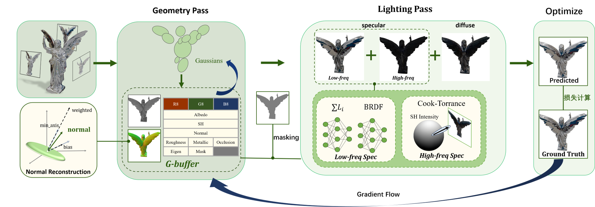

# Neural Gaussian Splatting for Physically Based Rendering without Environment Light Sampling

Official implementation of **"Neural Gaussian Splatting for Physically Based Rendering without Environment Light Sampling"**.

## Overview

Neural Gaussian Splatting for Physically Based Rendering without Environment Light Sampling is a novel rendering framework based on **3D Gaussian Splatting (3DGS)**, to enhance the specular component synthetic of 3DGS, for efficient scene reconstruction and photorealistic novel-view synthesis.

------

## Method

In recent years, 3D Gaussian splatting has leveraged physical reflection models to enhance specular reflection. However, these methods typically require differentiable environment light sampling during training, making it challenging to balance rendering quality and computational efficiency. 

 We propose a neural Gaussian splatting physical rendering method without environment light sampling, which employs a lightweight dual-network architecture to implicitly model low-frequency specular reflections and combines spherical harmonics with the Cook-Torrance model to supplement high-frequency information. This design simultaneously resolves the limitations of single-order spherical harmonics in capturing both low-frequency and high-frequency signals without introducing artifacts, achieving unified modeling of different frequency reflection components and efficient rendering. Furthermore, to overcome the challenge of estimating surface normals for 3D Gaussian primitives, we introduce an eigenvalue-guided normal contraction strategy to guide reliable surface normal reconstruction.



------

## Installation

### Tested Environment

- Ubuntu 22.04
- CUDA 11.8
- NVIDIA RTX 4080 / RTX 4090
- Python 3.10

### Clone Repository

```bash
git clone https://github.com/OwODarkness/EnvSample_Free_3DGS.git
cd EnvSample_Free_3DGS
```

### Create Environment

```bash
conda env create -f environment.yml
conda activate envsample_free_3dgs
```

### 

------

## Dataset

We primarily evaluate our method on the [Glossy Synthetic](https://liuyuan-pal.github.io/NeRO/), [Shiny Blender Real](https://storage.googleapis.com/gresearch/refraw360/ref_real.zip), [Glossy Real](https://liuyuan-pal.github.io/NeRO/)

## Training

Train a scene using:

```bash
python train.py \
    -s dataset/luyu_blender \
    -m output/luyu_blender \
    --eval \
    -w
```

### Arguments

| Argument    | Description                      |
| ----------- | -------------------------------- |
| `-s`        | Dataset path                     |
| `-m`        | Output directory                 |
| `--eval`    | Enable evaluation                |
| `-w`        | White Background                 |
| --roughness | Roughness default value of scene |
| --metallic  | Metallic default value of scene  |

> To evaluate the Glossy Synthetic dataset, use `--roughness 0.3 --metallic 0.7`, as the scenes mainly contain highly reflective and metallic materials.
>
> To evaluate the Shiny Blender Real and Glossy Real datasets, use `--roughness 0.7 --metallic 0.3`, as these datasets generally exhibit rougher surfaces and weaker metallic reflections.

## Rendering

Render trained results using:

```bash
python render.py -m output/luyu_blender
```

------

## Results

### Qualitative Results


### Quantitative Results

Glossy Synthetic

| Method  | PSNR ↑    | SSIM ↑    | LPIPS ↓   | Train Time | FPS  |
| ------- | --------- | --------- | --------- | ---------- | ---- |
| 3DGS    | 26.17     | 0.915     | 0.087     | 00:06:15   | 131  |
| GShader | 27.07     | 0.923     | 0.083     | 01:04:00   | 39   |
| Ours    | **27.75** | **0.929** | **0.075** | 00:20:21   | 57   |

## Citation


------

## Acknowledgements

This work is built upon the following excellent projects:

- NeRF
- 3D Gaussian Splatting
- GaussianShader
