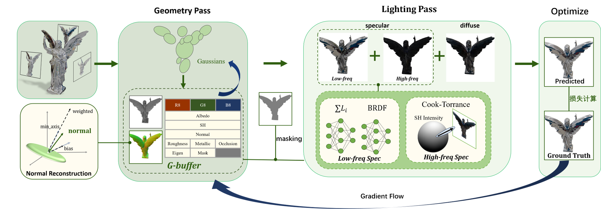

# Neural Gaussian Splatting for Physically Based Rendering without Environment Light Sampling

Official implementation of **"Neural Gaussian Splatting for Physically Based Rendering without Environment Light Sampling"**.

[](https://github.com/OwODarkness/EnvSample_Free_3DGS/blob/main/docs/video/show.mp4)

## Overview

Neural Gaussian Splatting for Physically Based Rendering without Environment Light Sampling is a novel rendering framework based on **3D Gaussian Splatting (3DGS)**, to enhance the specular component synthetic of 3DGS, for efficient scene reconstruction and photorealistic novel-view synthesis.

------

## Method

Recent 3D Gaussian Splatting methods use physically based reflection models to improve specular appearance, but often perform explicit multi-directional sampling and integration of a differentiable environment map during training, increasing computational cost.

We introduce a neural Gaussian splatting renderer without explicit environment-light sampling. A lightweight dual-network structure implicitly models low-frequency specular reflections, while spherical harmonics and the Cook–Torrance model supplement high-frequency details. This avoids explicit sampling and integration of a differentiable environment map during training. We also introduce an eigenvalue-guided normal contraction strategy to improve the stability of surface normal reconstruction.



------

## Installation

### Tested Environment

- Ubuntu 22.04
- CUDA 11.8
- NVIDIA RTX 4080 / RTX 4090
- Python 3.10

### Clone Repository

```bash
git clone https://github.com/OwODarkness/EnvSample_Free_3DGS.git
cd EnvSample_Free_3DGS
```

### Create Environment

```bash
conda env create -f environment.yml
conda activate envsample_free_3dgs
```

### 

------

## Dataset

We primarily evaluate our method on the [Glossy Synthetic](https://liuyuan-pal.github.io/NeRO/), [Ref Real](https://storage.googleapis.com/gresearch/refraw360/ref_real.zip), [Glossy Real](https://liuyuan-pal.github.io/NeRO/)

## Training

Train a scene using:

```bash
python train.py \
    -s dataset/luyu_blender \
    -m output/luyu_blender \
    --eval \
    -w
```

### Arguments

| Argument    | Description                      |
| ----------- | -------------------------------- |
| `-s`        | Dataset path                     |
| `-m`        | Output directory                 |
| `--eval`    | Enable evaluation                |
| `-w`        | White Background                 |
| --roughness | Roughness default value of scene |
| --metallic  | Metallic default value of scene  |

> To evaluate the Glossy Synthetic dataset, use `--roughness 0.3 --metallic 0.7`, as the scenes mainly contain highly reflective and metallic materials.
>
> To evaluate the Ref Real and Glossy Real datasets, use `--roughness 0.7 --metallic 0.3`, as these datasets generally exhibit rougher surfaces and weaker metallic reflections.

## Rendering

Render trained results using:

```bash
python render.py -m output/luyu_blender
```

### SIBR Interactive Viewer

Instructions for building and running the Windows SIBR viewer:

- [Build and run guide (English)](docs/sibr_viewer_install_run_en.md)
- [安装与运行指南（中文）](docs/sibr_viewer_install_run_zh.md)

------

## Results

### Glossy Synthetic


**Quantitative results**

| Method | PSNR ↑ | SSIM ↑ | LPIPS ↓ |
| ------ | -----: | -----: | ------: |
| 3DGS | 26.17 | 0.915 | 0.087 |
| GShader | 27.07 | 0.923 | 0.083 |
| GS-IR | 26.50 | 0.915 | 0.084 |
| 3DGS-DR | 27.71 | **0.935** | **0.072** |
| Ours | **27.75** | 0.929 | 0.076 |

**Training efficiency (Glossy Synthetic)**

| Method | Train Time (min) ↓ | FPS ↑ |
| ------ | -----------------: | ----: |
| 3DGS | 6.25 | 130 |
| GShader | 64.00 | 39 |
| Ours | 20.35 | 57 |

### Ref Real


| Method | PSNR ↑ | SSIM ↑ | LPIPS ↓ |
| ------ | -----: | -----: | ------: |
| 3DGS | **23.59** | **0.642** | **0.268** |
| GShader | 22.49 | 0.623 | 0.324 |
| GS-IR | 23.33 | 0.631 | 0.304 |
| 3DGS-DR | 23.54 | 0.641 | 0.297 |
| Ours | 23.52 | 0.638 | 0.293 |

### Glossy Real


| Method | PSNR ↑ | SSIM ↑ | LPIPS ↓ |
| ------ | -----: | -----: | ------: |
| 3DGS | 22.88 | 0.814 | **0.210** |
| GShader | 21.98 | 0.791 | 0.248 |
| GS-IR | 22.78 | 0.810 | 0.226 |
| 3DGS-DR | 21.59 | 0.793 | 0.243 |
| Ours | **23.05** | **0.815** | 0.215 |

### Normal Reconstruction (Glossy Synthetic)


Quantitative results are the arithmetic means across the eight Glossy Synthetic scenes. Acc@τ is the percentage of pixels in the intersection of the GT and predicted foreground masks whose normal angular error is at most τ.

| Method | Cosine ↑ | Mean angle error ↓ (°) | RMSE ↓ (°) | Acc@11.25° ↑ | Acc@22.5° ↑ | Acc@30° ↑ |
| ------ | -------: | --------------------: | ---------: | ------------: | ----------: | --------: |
| 3DGS | 0.6037 | 48.67 | 54.88 | 4.42% | 15.88% | 26.11% |
| GShader | 0.8830 | 22.27 | 28.86 | 32.32% | 63.87% | 76.26% |
| GS-IR | 0.7948 | 32.56 | 38.40 | 12.36% | 37.44% | 53.30% |
| 3DGS-DR | 0.8815 | 21.65 | 28.71 | 38.66% | 66.33% | 76.94% |
| Ours | **0.9002** | **20.66** | **26.11** | 33.67% | **66.68%** | **79.68%** |

## Citation


------

## Acknowledgements

This work is built upon the following excellent projects:

- NeRF
- 3D Gaussian Splatting
- GaussianShader
